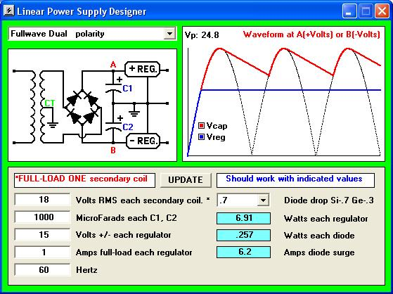



## Linear Power Supply Designer

### Description

This program will help you design any of the five most popular linear power supplies.

It assumes no resistive losses in the transformer windings. Basically, it gives you a quick &#8216;ball park&#8217; design to work with.

This program helps you get close to a working final design. But you will need to connect your final design to an oscilloscope to determine if your supply will hold up under actual full power conditions.
 
### More Info
 

             |
---                |---
**Submitted On**   |2010-02-03 10:38:06
**By**             |[RandyT\_CS](https://github.com/Planet-Source-Code/PSCIndex/blob/master/ByAuthor/randyt-cs.md)
**Level**          |Beginner
**User Rating**    |5.0 (25 globes from 5 users)
**Compatibility**  |VB 6\.0
**Category**       |[Complete Applications](https://github.com/Planet-Source-Code/PSCIndex/blob/master/ByCategory/complete-applications__1-27.md)
**World**          |[Visual Basic](https://github.com/Planet-Source-Code/PSCIndex/blob/master/ByWorld/visual-basic.md)
**Archive File**   |[Linear\_Pow217418232010\.zip](https://github.com/Planet-Source-Code/randyt-cs-linear-power-supply-designer__1-72888/archive/master.zip)

